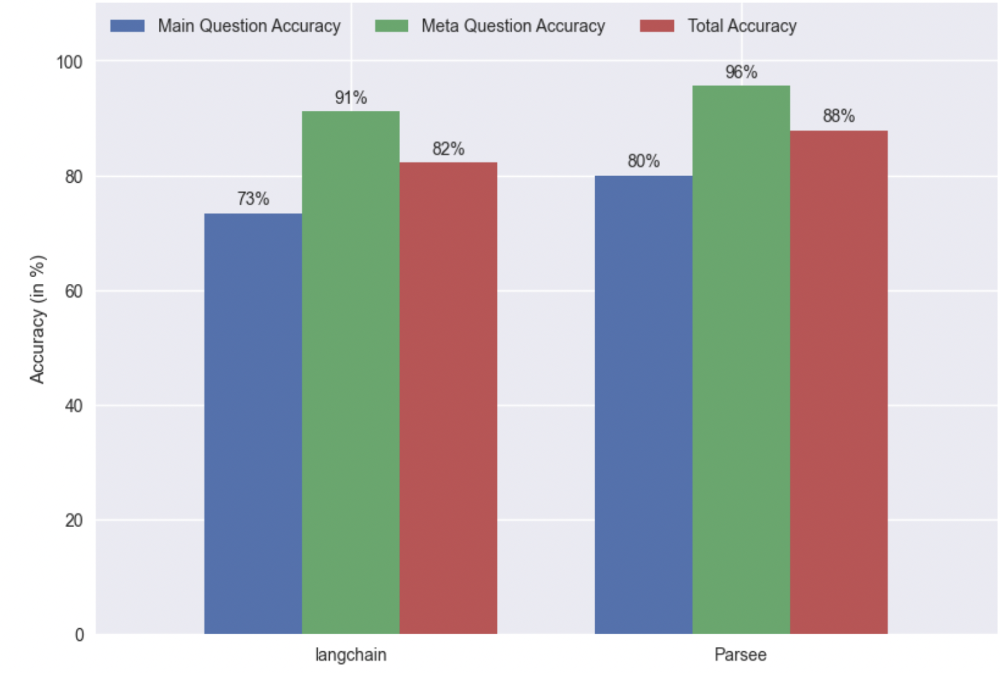

# Extracting Structured Data from Invoices - Parsee PDF Reader vs. Langchain PyPDF Loader

With the datasets in this folder we want to test how the results of an LLM for extracting structured data from invoices differs for different document loaders.

Both datasets have their own Readme's with more info about the methodology, notebooks for the creation of the dataset and evaluation results:
* [Parsee Loader](./parsee-loader/README.md)
* [Langchain Loader](./langchain-pypdf-loader/README.md)

The extraction template used is this one (in the files the template ID might be different as it was run locally): https://app.parsee.ai/template/65f959afe34036446ee859ff

## TLDR
Even though the Parsee PDF Reader was not initially designed for invoices (which have often quite fractured text pieces and tables that are difficult to structure properly), it is still able to outperform the langchain PyPDF reader with a total accuracy of 88% vs. 82% for the langchain reader.

