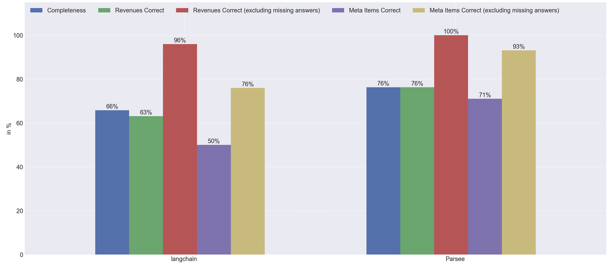

# Revenues Dataset - Parsing Tables

This dataset consists of 15 pages from annual/quarterly reports of German companies (PDF files), the filings are in English though.

The goal is to evaluate two things:
1) how well can a state-of-the-art LLM retrieve complex structured information from the documents?
2) how does the Parsee.ai document loader fare against the langchain PyPDF loader for this document type

We are using the Claude 3 Opus model for all runs here, as this was the most capable model in our prior experiments (beating GPT 4).

Both datasets have their own Readme's with more info about the methodology, notebooks for the creation of the dataset and evaluation results:
* [Parsee Loader](./parsee-loader/README.md)
* [Langchain Loader](./langchain-pypdf-loader/README.md)

## TLDR

Explanation of results:
* Completeness: This measures how often the model gave the expected amount of answers. For example for [this](https://app.parsee.ai/documents/view/e728768d8ebb9cea4e96406352bed0838534a0080621519cd2cc8147828f9f18) file, there are 5 columns with a "Revenue" figure in them. So we are expecting the model to return 5 different "answers", each with one of the revenue figures (you can see these in the tab "Extracted Data" on Parsee Cloud)
* Revenues Correct: How many times the model extracted a valid "Revenues" figure. If the answer was missing completely, this is counted here as well (so this both accounts for wrong answers, and also missing answers)
* Revenues Correct (excluding missing answers): This is disregarding the cases where the model simply did not extract the right figure at all, so basically, if it extracted the figure (matched based on the meta information), was it the correct number?
* Meta Items Correct: How many times did the model extract all the expected meta information (time periods, currencies etc.; missing answers are counted here as well)
* Meta Items Correct (excluding missing answers): If the model found a valid revenues number, how many times was all the meta information attached to it correct? (this is not counting the times where the answer was missing entirely)